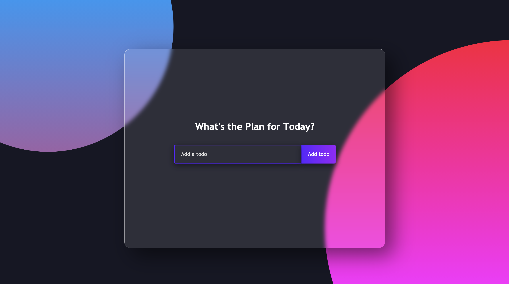

# React Todo List

 

A simple todo list app to track your todos by adding, updating and deleting. This project was bootstrapped with [Create React App](https://github.com/facebook/create-react-app).

## Installation

1. Download or clone repository
2. `npm install` to install the required npm packages to run

## Usage

* Application will be invoked by using the following command:
    `npm start`

* Users can add a todo and stored in localStorage

* Update existing todos

* And delete when todo is completed

## Links

* [Github](https://github.com/mmeii/react-todo-list)
* [Deployed](https://iammei.com/react-todo-list/)

## Features

* JavaScript
* Node
* React
* localStorage

## License

  Copyright (c) Mengmei Tu. All rights reserved.
  
  Licensed under the [MIT](LICENSE) license.
